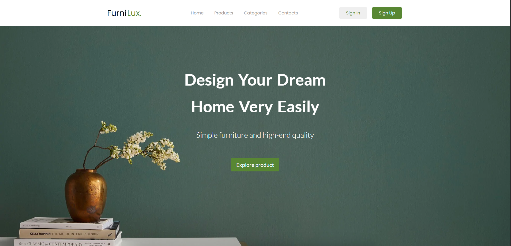
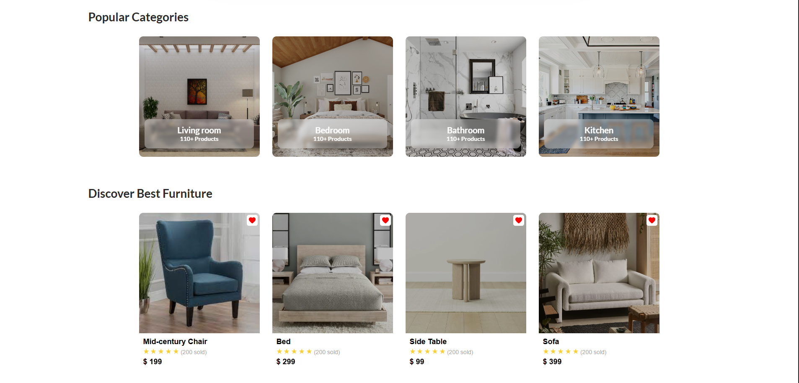
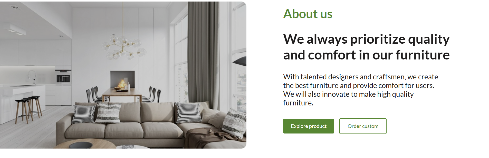

# FurniLux

Лендинг мебельного бренда **FurniLux** — минималистичный одностраничный сайт о качественной мебели и уютном интерьере.

## О проекте

FurniLux — учебная вёрстка лендинга интернет-магазина мебели. Страница собрана на чистом HTML и CSS: hero-блок, категории комнат, карточки товаров, блок About us и адаптивная навигация.

**Стек:** HTML5 · CSS3 · Google Fonts (Poppins, Lato)

## Демонстрация

### Hero

Главный экран с навигацией, заголовком и CTA.

  

### Категории и товары

Популярные комнаты и блок Discover Best Furniture с карточками продуктов.

  

### About us

Секция о бренде: фото интерьера, описание и кнопки действий.

  

## Запуск

Откройте `index.html` в браузере — дополнительных зависимостей не требуется.
